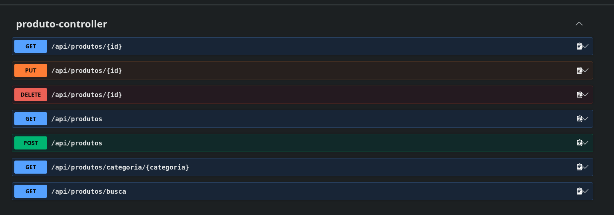

# Estoque API

API REST para gerenciamento de produtos e estoque, desenvolvida com **Java 21, Spring Boot e PostgreSQL**.

O projeto implementa um CRUD completo de produtos, validação de dados, tratamento global de exceções, persistência com JPA/Hibernate, testes automatizados e documentação da API com Swagger/OpenAPI.

## Tecnologias

* Java 21
* Spring Boot 4.1.1
* Spring Data JPA
* Hibernate
* PostgreSQL
* Maven
* Lombok
* Bean Validation
* JUnit 6
* Mockito
* Swagger / OpenAPI

## Funcionalidades

* Cadastro de produtos
* Listagem de produtos
* Busca de produto por ID
* Atualização de produtos
* Remoção de produtos
* Busca por categoria
* Busca por nome
* Validação dos dados recebidos
* Tratamento global de exceções
* Documentação interativa com Swagger
* Testes de Service e Controller

## Arquitetura

O projeto utiliza uma arquitetura em camadas para separar as responsabilidades:

```text
Controller
    ↓
Service
    ↓
Repository
    ↓
PostgreSQL
```

### Estrutura

```text
src/main/java/br/com/jalo/estoque_api/

├── controller/
│   └── ProdutoController.java
│
├── dto/
│   ├── ProdutoRequest.java
│   ├── ProdutoResponse.java
│   └── ErroResponse.java
│
├── exception/
│   ├── GlobalExceptionHandler.java
│   └── ProdutoNaoEncontradoException.java
│
├── model/
│   └── Produto.java
│
├── repository/
│   └── ProdutoRepository.java
│
└── service/
    └── ProdutoService.java
```

## Endpoints

### Listar produtos

```http
GET /api/produtos
```

### Buscar produto por ID

```http
GET /api/produtos/{id}
```

### Criar produto

```http
POST /api/produtos
```

Exemplo:

```json
{
  "nome": "Arroz 5kg",
  "preco": 25.90,
  "quantidade": 30,
  "categoria": "Alimentos"
}
```

### Atualizar produto

```http
PUT /api/produtos/{id}
```

Exemplo:

```json
{
  "nome": "Arroz 5kg",
  "preco": 28.90,
  "quantidade": 25,
  "categoria": "Alimentos"
}
```

### Remover produto

```http
DELETE /api/produtos/{id}
```

### Buscar por categoria

```http
GET /api/produtos/categoria/{categoria}
```

Exemplo:

```http
GET /api/produtos/categoria/Alimentos
```

### Buscar por nome

```http
GET /api/produtos/busca?nome=arroz
```

## Validações

A API realiza validações nos dados recebidos.

Exemplos:

* Nome obrigatório
* Categoria obrigatória
* Preço maior que zero
* Quantidade maior ou igual a zero

As exceções de validação e os erros de produto não encontrado são tratados por um `GlobalExceptionHandler`.

## Banco de Dados

O projeto utiliza **PostgreSQL** com **Spring Data JPA** e **Hibernate**.

Banco utilizado no ambiente local:

```text
estoque_java
```

Configuração:

```properties
spring.datasource.url=jdbc:postgresql://localhost:5432/estoque_java
spring.datasource.username=postgres
spring.datasource.password=SUA_SENHA
```

## Testes

O projeto possui testes automatizados para as principais funcionalidades da aplicação.

Para executar:

```bash
mvn clean test
```

Resultado atual:

```text
Tests run: 13
Failures: 0
Errors: 0
Skipped: 0
```

## Swagger / OpenAPI

A API possui documentação interativa através do Swagger.

Com a aplicação em execução:

```text
http://localhost:8080/swagger-ui.html
```

### Exemplo da documentação



## Como executar o projeto

### Pré-requisitos

* Java 21
* Maven
* PostgreSQL

### 1. Clone o repositório

```bash
git clone https://github.com/JaloMamadjam/estoque-api.git
cd estoque-api
```

### 2. Crie o banco de dados

No PostgreSQL:

```sql
CREATE DATABASE estoque_java;
```

### 3. Configure o banco

Edite:

```text
src/main/resources/application.properties
```

e informe sua senha do PostgreSQL.

### 4. Execute os testes

```bash
mvn clean test
```

### 5. Execute a aplicação

```bash
mvn spring-boot:run
```

A aplicação será executada em:

```text
http://localhost:8080
```

Swagger:

```text
http://localhost:8080/swagger-ui.html
```

## Objetivo do projeto

Este projeto foi desenvolvido como prática de desenvolvimento backend com Java e Spring Boot, aplicando conceitos de:

* APIs REST
* Spring Boot
* Spring Data JPA
* PostgreSQL
* DTOs
* Validação de dados
* Tratamento de exceções
* Testes automatizados
* Arquitetura em camadas
* Documentação de APIs

## Autor

**Jalo Mamadjam**

Estudante de Engenharia de Computação — UFSC

GitHub: [JaloMamadjam](https://github.com/JaloMamadjam)
